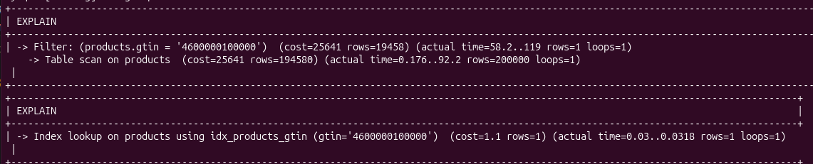

# Task 14 - Индексы в MySQL

## 1) Добавил поле описания и полнотекстовое поле

```sql
ALTER TABLE products
  ADD COLUMN IF NOT EXISTS description TEXT NULL;

ALTER TABLE products
  ADD COLUMN IF NOT EXISTS search_text TEXT
    GENERATED ALWAYS AS (
      LOWER(CONCAT_WS(' ',
        COALESCE(name, ''),
        COALESCE(description, ''),
        COALESCE(JSON_UNQUOTE(JSON_EXTRACT(attributes_json, '$.color')), ''),
        COALESCE(JSON_EXTRACT(attributes_json, '$.tags'), '')
      ))
    ) STORED;
```

## 2) Индексы

```sql
CREATE INDEX IF NOT EXISTS idx_products_client_unit_name
  ON products (client_id, unit, name);

CREATE INDEX IF NOT EXISTS idx_products_gtin
  ON products (gtin);

CREATE FULLTEXT INDEX IF NOT EXISTS ftx_products_search_text
  ON products (search_text);
```

## 3) EXPLAIN до/после

Без составного индекса:

```sql
DROP INDEX IF EXISTS idx_products_client_unit_name ON products;
EXPLAIN FORMAT=TRADITIONAL
SELECT id, client_id, sku, name, unit
FROM products
WHERE client_id = 1 AND unit IN ('pcs', 'box')
ORDER BY name;
```


После добавления:

```sql
CREATE INDEX idx_products_client_unit_name
  ON products (client_id, unit, name);
EXPLAIN FORMAT=TRADITIONAL
SELECT id, client_id, sku, name, unit
FROM products
WHERE client_id = 1 AND unit IN ('pcs', 'box')
ORDER BY name;
```



Было: 119 ms
Стало: 0.0318 ms
Ускорение: 3700 раз

## 4) Полнотекстовый поиск

```sql
EXPLAIN FORMAT=TRADITIONAL
SELECT id, sku, name,
       MATCH(search_text) AGAINST('+medical +blue' IN BOOLEAN MODE) AS score
FROM products
WHERE MATCH(search_text) AGAINST('+medical +blue' IN BOOLEAN MODE)
ORDER BY score DESC;
```

