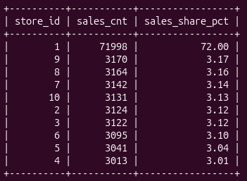
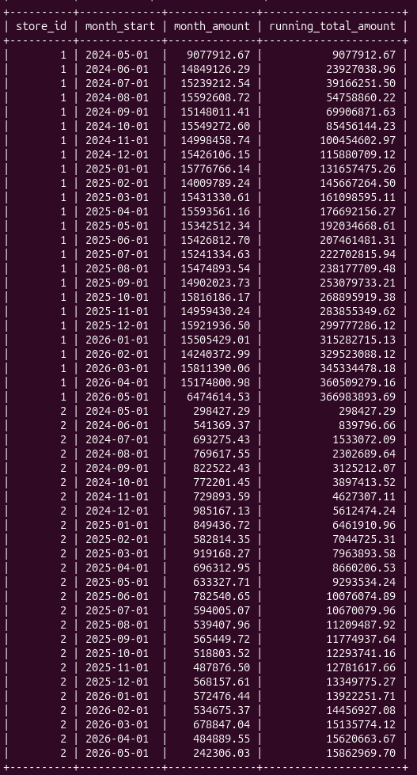
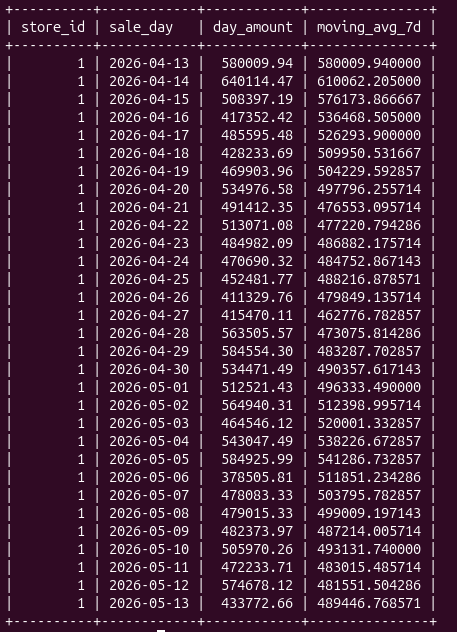

# Task 15 - CTE и аналитические функции в MySQL

## 1) Таблицы

```sql
CREATE TABLE IF NOT EXISTS stores (
  store_id BIGINT UNSIGNED AUTO_INCREMENT PRIMARY KEY,
  address VARCHAR(50) NOT NULL
) ENGINE=InnoDB;

CREATE TABLE IF NOT EXISTS sales (
  sale_id BIGINT UNSIGNED AUTO_INCREMENT PRIMARY KEY,
  store_id BIGINT UNSIGNED NOT NULL,
  date TIMESTAMP NOT NULL,
  sale_amount DECIMAL(10,2) NOT NULL
) ENGINE=InnoDB;
```



## 2) Нарастающий итог по месяцам

```sql
WITH monthly_sales AS (
  SELECT store_id, DATE_FORMAT(date, '%Y-%m-01') AS month_start, SUM(sale_amount) AS month_amount
  FROM sales
  GROUP BY store_id, DATE_FORMAT(date, '%Y-%m-01')
)
SELECT
  store_id,
  month_start,
  month_amount,
  SUM(month_amount) OVER (
    PARTITION BY store_id
    ORDER BY month_start
    ROWS BETWEEN UNBOUNDED PRECEDING AND CURRENT ROW
  ) AS running_total_amount
FROM monthly_sales
ORDER BY store_id, month_start;
```


## 3) 7-дневное скользящее среднее за последний месяц по топ-магазину

```sql
WITH top_store AS (
  SELECT store_id
  FROM sales
  GROUP BY store_id
  ORDER BY COUNT(*) DESC, store_id
  LIMIT 1
),
daily_sales AS (
  SELECT s.store_id, DATE(s.date) AS sale_day, SUM(s.sale_amount) AS day_amount
  FROM sales s
  INNER JOIN top_store t ON t.store_id = s.store_id
  WHERE s.date >= DATE_SUB(CURDATE(), INTERVAL 1 MONTH)
  GROUP BY s.store_id, DATE(s.date)
)
SELECT
  store_id,
  sale_day,
  day_amount,
  AVG(day_amount) OVER (
    PARTITION BY store_id
    ORDER BY sale_day
    ROWS BETWEEN 6 PRECEDING AND CURRENT ROW
  ) AS moving_avg_7d
FROM daily_sales
ORDER BY sale_day;
```


Что учел:

1. Фильтр на “последний месяц”
`WHERE s.date >= DATE_SUB(CURDATE(), INTERVAL 1 MONTH)` - скользящее среднее считается только на актуальном интервале, а не по всей истории.

2.  неполное окно 7 дней
`ROWS BETWEEN 6 PRECEDING AND CURRENT ROW` - в начале периода считает среднее по доступным дням

3. Фильтр на последний месяц
`WHERE s.date >= DATE_SUB(CURDATE(), INTERVAL 1 MONTH)` - скользящее среднее считается только на актуальном интервале, а не по всей истории.