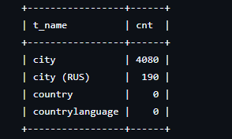

# Task 18 - Восстановить таблицу из бэкапа (MySQL)

Цель: восстановить таблицу `world.city` из файла `backup.xbs.gz-195395-cb4390.aes`.


## Ход работы

### 1) Подготовка бэкапа

```bash
mkdir -p ~/task18/{work,extract,stage}
cd ~/task18
```

Файл бэкапа:

```bash
cp ~/task18/backup.xbs.gz-195395-cb4390.aes .
```

Расшифровка и распаковка потока `xbstream`:

```bash
docker run --rm --user root -v /home/codex/task18:/data percona/percona-xtrabackup:8.4 bash -lc '
  openssl aes-256-cbc -d -pbkdf2 -k "password" -in /data/backup.xbs.gz-195395-cb4390.aes -out /data/task18/work/backup.xbs.gz
  gzip -d -f /data/task18/work/backup.xbs.gz
  xbstream -x -C /data/task18/extract < /data/task18/work/backup.xbs
'
```

Проверка, что внутри есть таблицы `world`:

```bash
find ~/task18/extract/world -maxdepth 1 -type f
```


### 2) Подготовка исходной базы world

```bash
cd ~/restore_world/world-src
curl -O https://downloads.mysql.com/docs/world-db.zip
unzip world-db.zip
```

### 3) Восстановление `.ibd` файлов

Подготовка таблиц к импорту:

```sql
USE world18c;
SET FOREIGN_KEY_CHECKS=0;
ALTER TABLE country DISCARD TABLESPACE;
ALTER TABLE city DISCARD TABLESPACE;
SET FOREIGN_KEY_CHECKS=1;
```

Копирование файлов из бэкапа в datadir контейнера:

```bash
docker cp ~/task18/extract/world/country.ibd otus-mysql-task18:/var/lib/mysql/world18c/country.ibd
docker cp ~/task18/extract/world/city.ibd otus-mysql-task18:/var/lib/mysql/world18c/city.ibd
docker exec otus-mysql-task18 chown mysql:mysql /var/lib/mysql/world18c/country.ibd /var/lib/mysql/world18c/city.ibd
```

Импорт tablespace:

```sql
USE world18c;
SET FOREIGN_KEY_CHECKS=0;
ALTER TABLE country IMPORT TABLESPACE;
ALTER TABLE city IMPORT TABLESPACE;
SET FOREIGN_KEY_CHECKS=1;
```

## Проверка

```sql
USE world18c;У2ЙЪ\ЗХ-

SELECT 'city' AS t_name, COUNT(*) AS cnt FROM city
UNION ALL
SELECT 'city (RUS)', COUNT(*) FROM city WHERE countrycode = 'RUS'
UNION ALL
SELECT 'country', COUNT(*) FROM country;
```

Полученный результат:


## Итог

Таблица `city` успешно восстановлена из зашифрованного бэкапа через `DISCARD/IMPORT TABLESPACE`.
