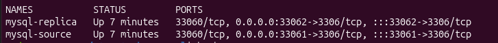
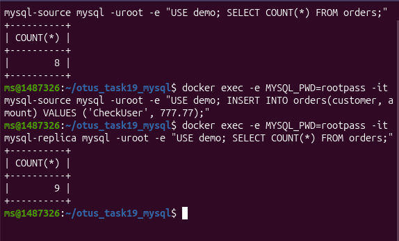

# Task 19 - Настроить репликацию MySQL (Source -> Replica, GTID)

## Что сделано

1. Поднят стенд из двух инстансова `mysql-source` и `mysql-replica`.
2. Включен GTID режим, `ROW` binlog format.
3. Replica настроена в `read_only/super_read_only`.
4. Показана асинхронная репликация и загрузка данных на Source.
5. Добавлена выборочная репликация (исключены системные БД) в конфиге Replica.

Файлы:
- `docker-compose.yml`
- `source-init.sql`

## Запуск

```bash
cd results/otus_hw/task_19
docker compose up -d
```


## Настройка Replica

```bash
# На replica:
docker exec -it mysql-replica mysql -uroot -prootpass -e "
CHANGE REPLICATION SOURCE TO
 \9  SOURCE_HOST='mysql-source',
  SOURCE_PORT=3306,
  SOURCE_USER='repl',
  SOURCE_PASSWORD='replpass',
  SOURCE_AUTO_POSITION=1,
  GET_SOURCE_PUBLIC_KEY=1;
START REPLICA;
"
```

## Проверка

```bash
# Статус репликации
docker exec -it mysql-replica mysql -uroot -prootpass -e "SHOW REPLICA STATUS\\G"

# Данные на source
docker exec -it mysql-source mysql -uroot -prootpass -e "USE demo; INSERT INTO orders(customer, amount) VALUES ('Sergey', 1999.99); SELECT COUNT(*) FROM orders;"

# Данные на replica
docker exec -it mysql-replica mysql -uroot -prootpass -e "USE demo; SELECT COUNT(*) FROM orders;"
```

