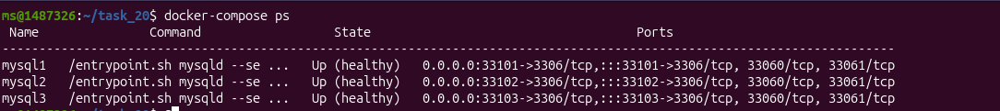
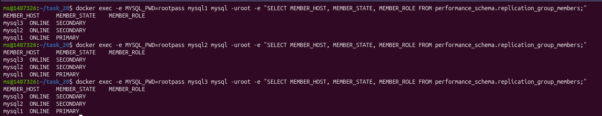
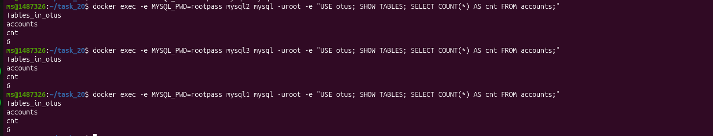
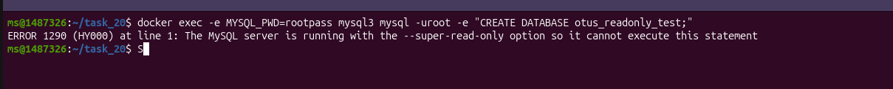
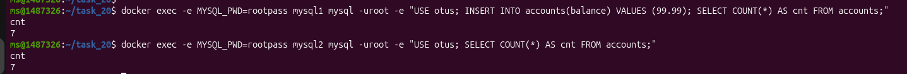

# Task 20 - Развернуть кластер MySQL (3 ноды)

## Задание
Развернуть кластер MySQL из 3 нод, продемонстрировать его работу, показать статус кластера на каждой ноде, загрузить данные и показать `show tables` и `count(*)` на каждой ноде.

Задание со звездочкой: показать работу кластера при отказе одной ноды.

## Запуск
```bash
cd results/otus_hw/task_20
docker compose up -d
```

Поднят кластер из 3 нод MySQL 8.0:


Конфигурация нод собрана через docker-compose.yml с включенным Group Replication.


## Инициализация Group Replication
На каждой ноде:

```sql
SET SQL_LOG_BIN=0;
CREATE USER IF NOT EXISTS 'repl'@'%' IDENTIFIED BY 'replpass';
GRANT REPLICATION SLAVE ON *.* TO 'repl'@'%';
GRANT BACKUP_ADMIN ON *.* TO 'repl'@'%';
FLUSH PRIVILEGES;
SET SQL_LOG_BIN=1;

CHANGE REPLICATION SOURCE TO SOURCE_USER='repl', SOURCE_PASSWORD='replpass'
FOR CHANNEL 'group_replication_recovery';
```

Запуск репликации:

```sql
-- mysql1
SET GLOBAL group_replication_bootstrap_group=ON;
START GROUP_REPLICATION;
SET GLOBAL group_replication_bootstrap_group=OFF;

-- mysql2 и mysql3
START GROUP_REPLICATION;
```

## Проверка статуса кластера
На каждой ноде:

```sql
SELECT MEMBER_HOST, MEMBER_STATE, MEMBER_ROLE
FROM performance_schema.replication_group_members;
```




## Загрузка данных
На primary (`mysql1`):

```sql
CREATE DATABASE IF NOT EXISTS otus;
USE otus;

CREATE TABLE IF NOT EXISTS accounts (
  id BIGINT PRIMARY KEY AUTO_INCREMENT,
  balance DECIMAL(10,2) NOT NULL
);

INSERT INTO accounts(balance)
VALUES (10.00), (20.00), (30.00), (10.00), (20.00), (30.00);
```

## Проверка данных на всех нодах
На каждой ноде:

```sql
SHOW DATABASES;
USE otus;
SHOW TABLES;
SELECT COUNT(*) FROM accounts;
```



## Проверка read-only на secondary
На `mysql2`/`mysql3`:

```sql
CREATE DATABASE otus_readonly_test;
```



Ожидаемо: ошибка записи (secondary в `read-only`).

## Задание со звездочкой: отказ одной ноды
Остановить одну secondary-ноду:

```bash
docker stop mysql3
```




## Итог
- Кластер MySQL из 3 нод развернут.
- Статус кластера проверен на каждой ноде.
- Данные загружены и реплицированы на все узлы.
- Подтверждены `show tables` и `count(*)` на всех нодах.
- Проверен режим `read-only` на secondary.
- Показана работоспособность при отказе одной ноды.
