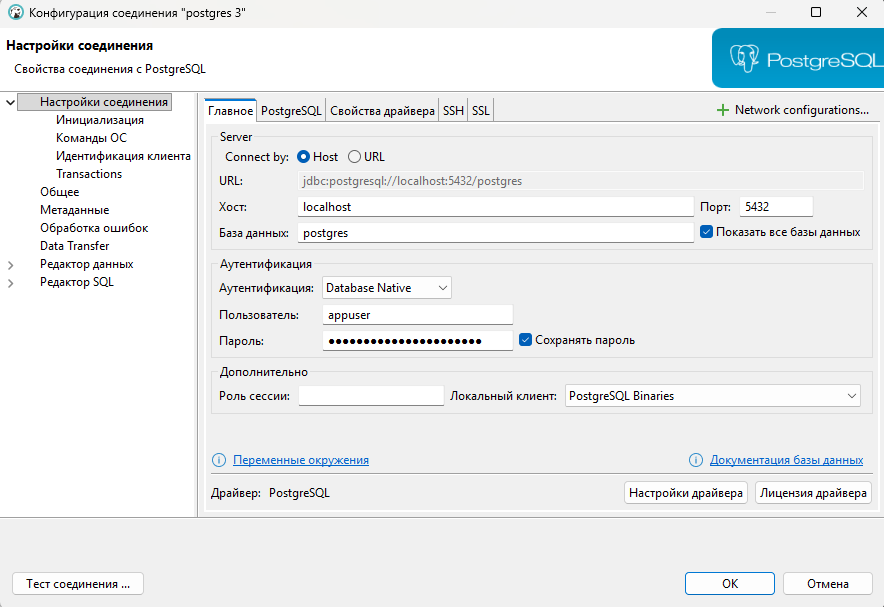
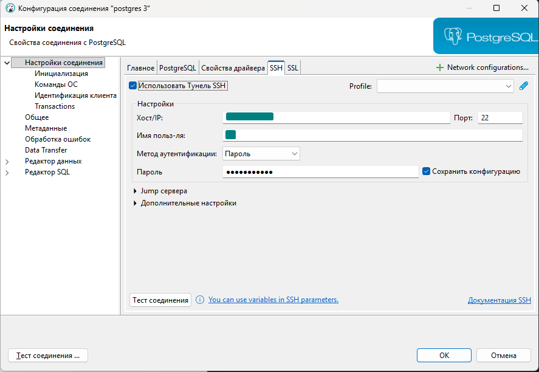

# Установка СУБД PostgreSQL 

**Домашнее задание**
```
Создать кластер PostgreSQL в докере или на виртуальной машине, запустить сервер и подключить клиента.

Описание/Пошаговая инструкция выполнения домашнего задания:

Развернуть контейнер с PostgreSQL или установить СУБД на виртуальную машину.
Запустить сервер.
Создать клиента с подключением к базе данных postgres через командную строку.
Подключиться к серверу используя pgAdmin или другое аналогичное приложение.
```

## Установка Docker
```bash
sudo apt update
sudo apt install -y docker.io docker-compose-plugin
sudo systemctl enable docker
sudo systemctl start docker
```

## Создание католога
```bash
sudo mkdir -p /opt/pg/{data,conf}
sudo chown -R $USER:$USER /opt/pg
touch /opt/pg/conf/postgresql.conf
touch /opt/pg/conf/pg_hba.conf
touch /opt/pg/docer-compose.yml
```

## Настройка базы данных
`/opt/pg/conf/postgresql.conf`

```conf
listen_addresses = '0.0.0.0'
port = 5432
```
`/opt/pg/conf/pg_hba.conf`
```
local   all  all                      scram-sha-256

# docker network inspect bridge
host    all  all  172.16.0.0/12       scram-sha-256
```

## Настройка docker-compose
`/opt/pg/docer-compose.yml`

```yaml
services:
  postgres:
    image: postgres:16
    container_name: pg
    restart: unless-stopped

    ports:
      - "127.0.0.1:5432:5432"   # доступ только с localhost сервера

    environment:
      POSTGRES_DB: appdb
      POSTGRES_USER: appuser
      POSTGRES_PASSWORD: ""
      POSTGRES_INITDB_ARGS: "--auth=scram-sha-256"

    volumes:
      - /opt/pg/data:/var/lib/postgresql/data
      - /opt/pg/conf/postgresql.conf:/etc/postgresql/postgresql.conf:ro
      - /opt/pg/conf/pg_hba.conf:/etc/postgresql/pg_hba.conf:ro

    command: >
      postgres
      -c config_file=/etc/postgresql/postgresql.conf
      -c hba_file=/etc/postgresql/pg_hba.conf
```

### Запуск контейнера
```bash
cd /opt/pg
docker compose up -d
```

## Настройка DBearver 
### General
 
 
### SSH
  